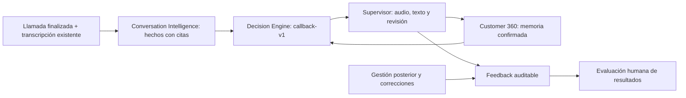

# Loop IA de Atlas: primera conexión vertical

Implementado el 27 de agosto de 2026. Migración productiva `20260827205310` aplicada a `atlas-crm`. Publicación y activación sujetas a la verificación del dominio y del piloto descrita abajo.

## Qué conecta



Se reutilizan `leads`, `calls`, `call_recordings` y `call_transcriptions`; no se crea otro maestro de clientes. La memoria de este piloto se limita al mismo lead, campaña y equipo de la grabación; no se mezcla entre campañas mediante RUT ni se consume contenido de WhatsApp.

El aprendizaje conectado consiste en **incorporar hechos confirmados a las próximas decisiones** y registrar la revisión y los resultados observados. No hay entrenamiento automático, cambio automático de política ni demostración causal de conversión. Los resultados comerciales se muestran para evaluación; no ajustan los pesos de un modelo.

## Recorrido operativo

1. Una campaña debe estar en `shadow`. Por defecto todas están apagadas.
2. Una grabación debe estar disponible y dentro de retención, tener transcripción completa coincidente con su SHA, y una llamada finalizada con outcome o motivo. No se inicia Whisper ni se transcriben audios desde este loop.
3. Los triggers encolan una versión. El worker también reconcilia las **200 grabaciones transcritas más recientes del conjunto de campañas habilitadas**; no es un backfill histórico exhaustivo.
4. Un worker toma un intento mediante lease y token. Mercury recibe únicamente fragmentos numerados de la transcripción de esa llamada, no la memoria previa. Selecciona sus IDs y Atlas recupera la cita original, sin pedirle al modelo que la reescriba. Atlas rechaza referencias inexistentes o expresiones temporales inventadas.
5. `callback-v1` evalúa campaña, llamada abierta, agenda existente, restricciones, incertidumbre y memoria confirmada. Produce `callback_candidate`, `human_review` o `no_action`. La memoria previa obliga a revisión antes de proponer un nuevo callback.
6. En **Calidad → Loop IA**, el supervisor abre el audio protegido y la transcripción actual. Revisa por separado utilidad de la recomendación y exactitud de los hechos. Aceptar una recomendación no confirma los hechos ni contacta al cliente.
7. Los hechos confirmados aparecen en la ficha 360, para administrador/supervisor dentro de su alcance. La siguiente interacción compatible los incorpora a su decisión. No se muestran al ejecutivo en este piloto.
8. Las gestiones posteriores y sus correcciones se registran como observaciones, incluso si el análisis fuente sigue esperando en cola. No prueban que la sugerencia causó el resultado.
9. Un hecho incorrecto se puede retirar desde la ficha 360 con motivo, incluso si la decisión fuente venció o fue reemplazada. El retiro se audita y esa memoria no puede reactivarse con una revisión posterior.

## Controles y límites

| Control | Comportamiento |
|---|---|
| Contactos y operación | No hay adaptadores para llamar, enviar, agendar, reasignar ni cambiar prioridad. |
| Encendido global | `AI_LOOP_ENABLED=true`; cualquier otro valor evita procesamiento del worker. |
| Encendido por campaña | `configure_ai_loop(campaign_id, 'shadow', daily_limit)`, administrador con sesión válida. |
| Autenticación worker | Bearer `AI_LOOP_WORKER_SECRET` o `CRON_SECRET`, mínimo 32 caracteres; sin secreto válido responde 401 antes de acceder a datos. |
| Frecuencia configurada | Cada dos minutos; un análisis por solicitud. No representa cron desplegado. |
| Cupo | 20 intentos por campaña/día UTC por defecto; configurable 1–100. Incluye reintentos; apagar/encender no reinicia cupo. |
| Reintentos | Máximo tres por versión, espera de cinco minutos tras fallo; lease de 120 segundos. |
| Proveedor | Mercury 2, timeout de 35 segundos, hasta 60.000 caracteres de entrada; extracción estructurada. Facturación/compatibilidad real pendientes de piloto. |
| Vigencia decisión | Hasta 24 horas desde encolado o fin de retención, lo que ocurra primero. Contexto operativo es snapshot al tomar el trabajo, no una autorización en tiempo real. |
| Memoria | Hasta siete días o fin de retención. Una corrección de la transcripción invalida su recuperación; abrir otra llamada no la borra. |
| Permisos | RLS hereda la grabación fuente; acciones de revisión/retiro también validan rol, sesión y equipo dentro del RPC. |
| Retiro de fuente | Archivar/eliminar la grabación purga derivados; la reconciliación elimina derivados al vencer retención. RLS deja de exponerlos al vencer aunque el worker esté apagado. |
| Snapshots | No copian la transcripción completa ni citas de otras grabaciones; referencias previas por ID. Los hechos propios sí conservan su cita para auditoría. |
| Históricos | Las citas de una versión anterior pueden verse como evidencia histórica hasta retirar la fuente; no se recuperan como memoria vigente si cambió la transcripción. |
| Correcciones | Fuente versionada, review con control optimista y retiro de memoria independiente de la vigencia de la decisión. |
| Bigdata | No se modifica `generate_operation_feedback_v2` ni su contrato externo. El feedback de este piloto es local a Atlas. |

Apagar `AI_LOOP_ENABLED` evita nuevos intentos del worker, pero los triggers de campañas aún en `shadow` pueden seguir encolando. Para pausar completamente, **también apagar las campañas**: eso invalida los tokens de procesamiento y evita nuevas colas. El apagado global solo no cancela un proveedor que ya recibió una solicitud.

## Archivos principales

- `supabase/migrations/20260827205310_ai_learning_loop_shadow.sql`: cuatro tablas, RLS, triggers, funciones privadas y RPCs.
- `src/lib/ai-learning-loop.ts`: contratos, evidencia literal y política determinista.
- `src/lib/ai-learning-loop-worker.ts`: extracción y procesamiento de un intento.
- `src/app/api/ai/learning-loop/worker/route.ts`: endpoint secreto con doble habilitación.
- `src/app/dashboard/calidad/loop/page.tsx`: alcance, evidencia, revisión y resultados observados.
- `src/components/learning-memory-panel.tsx`: memoria en la ficha existente.
- `src/app/actions/ai-learning-loop.ts`: revisión, configuración y retiro autorizados.

## Verificación local

```sh
npm test
npx tsc --noEmit
npm run build
bash scripts/test-ai-learning-loop.sh
```

El último comando requiere `initdb`, `pg_ctl` y `psql`. Crea una base aislada por socket Unix en `/tmp/atlas-learning-loop.*`, carga fixtures y detiene el servidor al salir. No lee `.env`, datos de clientes ni credenciales productivas. Además de SQL/RLS, ejecuta el **worker TypeScript real contra los RPCs reales**; solo la respuesta del modelo es ficticia.

Cobertura: evidencia literal, prioridades de decisión, permisos por rol/equipo/sesión, control de lease, replay, reintentos, cupo, outcomes durante espera, revisiones de outcomes, fuente versionada, memoria 360, retiro irreversible de memoria vencida/reemplazada y purga de fuente. Las pruebas de render ejecutan la página y formularios reales con servicios y estilos sustituidos; no certifican una sesión productiva ni una revisión visual en navegador.

## Activación pendiente

1. Elegir y autorizar una campaña piloto, su límite diario y el análisis de transcripciones con el proveedor. No activar todas las campañas.
2. Revisar el estado real de migraciones antes de aplicar **esta** migración aditiva. No aplicar indiscriminadamente todas las migraciones locales pendientes.
3. Desplegar inicialmente con `AI_LOOP_ENABLED=false`, secretos de worker/cron y proveedor configurados. Ninguna clave se incorpora al repositorio.
4. Verificar proyecto Vercel `atlas2-0` y que **`atlascrm.geimser.cl`** corresponde al commit publicado: `vercel inspect https://atlascrm.geimser.cl --scope team_IJlj5eIFM7pBtOCDNOQN0eZs`.
5. Verificar en UI autenticada administrador, supervisor propio, supervisor ajeno y ejecutivo. Confirmar que audio y transcripción respetan el mismo alcance.
6. Habilitar solo la campaña elegida con un cupo pequeño y encender el worker. Verificar una extracción real, persistencia, revisión, memoria, decisión posterior, evento observado y retiro. Esto no autoriza una llamada de prueba: puede usarse una interacción operativa posterior o un entorno de pruebas.
7. Verificar cron real, consumo/costo, tasa de errores, solicitudes a revisión y hechos rechazados antes de ampliar el piloto.

Rollback operativo: campaña `off` + `AI_LOOP_ENABLED=false`. No borrar historial ni revertir destructivamente tablas para apagar el piloto.

La revisión de arquitectura original está en `atlas-ai-cinco-frentes-arquitectura-2026-08-27.md`. Esta conexión todavía no equivale a los cinco productos completos: no incorpora supervisión en vivo, memoria omnicanal, ejecución autónoma ni promoción automática de políticas.
