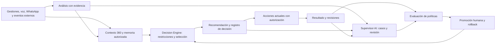

# Atlas: arquitectura para los cinco frentes de inteligencia

Fecha: 27 de agosto de 2026. Estado: propuesta para implementación, no implementada.

## 1. Dictamen y alcance

**Los cinco frentes son viables sobre Atlas. La inversión principal es conectar capacidades existentes mediante memoria, decisiones y resultados trazables.**

Se revisaron código, migraciones, contratos, permisos, servicios y pruebas del checkout `67bd404fbcc8f9dbd537b2008d7e686a1c6b551f`, rama `main`, con una revisión independiente de un agente con foco en arquitectura. El árbol incluye cambios locales previos en README y componentes de calidad; se conservaron. Este documento es el único archivo fuente agregado por esta revisión.

No se consultó la base productiva ni se certificó la UI, configuración de proveedores o ejecución de cron en producción. Las migraciones indican lo que declara el repositorio, no necesariamente el esquema aplicado. No se hicieron cambios funcionales, migraciones, llamadas, envíos, commits ni despliegues.

### Arquitectura que se conserva

- Next.js/React: aplicación, permisos, acciones y API.
- Supabase/Postgres: datos operativos, Auth, RLS, RPC, Storage y eventos.
- `dialer-engine/`: conexión persistente con Asterisk, discado, grabaciones e integración ElevenLabs.
- `lead-orchestrator/`: reserva/asignación de leads a agentes disponibles, separado de telefonía.
- Integración v2: recepción durable, orden de eventos, procesamiento, outbox, reintentos y feedback con otros sistemas.

La propuesta conserva esos límites. No requiere cinco microservicios, cambiar el motor telefónico ni comprar infraestructura para comenzar.

## 2. Qué existe y qué falta

| Frente | Base comprobada en código | Brecha para completar el frente |
| --- | --- | --- |
| **Decision Engine** | Reglas por campaña, prioridad externa, disponibilidad, reserva transaccional y auditoría de asignación. Bigdata entrega prioridad y razón. | Decidir acción/canal/momento/responsable considerando restricciones; registrar alternativas, política, vigencia, ejecución y resultado. |
| **Customer 360 + Memory** | `crm_entities`, `leads.crm_entity_id`, contactos normalizados, `get_lead_360`, timeline, referencias externas y mensajes WhatsApp. | Memoria con hechos verificables, procedencia, caducidad, contradicciones y permisos por fuente, consumida por todos los canales autorizados. |
| **Conversation Intelligence** | Grabaciones privadas, transcripción Groq y evaluación Mercury con resumen, objeciones, riesgos, citas y pauta versionada; artefactos ElevenLabs. | Extraer intención, compromisos y restricciones de forma independiente de calidad; convertirlos en memoria y señales operativas. |
| **Supervisor AI** | Monitor de agentes/colas, umbrales operativos, reportes, integridad y evaluaciones de calidad. | Casos priorizados con evidencia, recomendación, responsable, resolución y seguimiento; no solo indicadores. |
| **Closed Learning Loop** | Feedback operacional e infraestructura de intercambio durable. | Unir decisión → acción → resultado revisable; comparar políticas y promover mejoras verificadas con aprobación. |

### Evidencia principal

Las referencias corresponden al árbol local revisado; los números de línea pueden cambiar con futuras ediciones.

| Referencia | Qué demuestra |
| --- | --- |
| `supabase/migrations/20260702161438_crm_entities_assignments_records_rpc.sql:16` | Entidad maestra existente; índice único por RUT normalizado en línea 27 y enlace desde leads en línea 38. No crear otro maestro de clientes por defecto. |
| `supabase/migrations/20260702160838_crm_360_contacts_timeline.sql:147` | `get_lead_360` es `security invoker`; reúne contactos, llamadas e interacciones del lead visible. |
| `src/app/dashboard/leads/[id]/page.tsx:135` | Consumo del 360; desde línea 177 agrega referencias/eventos externos y mensajes con control de permisos. |
| `supabase/migrations/20260810233000_kovacs_lead_orchestrator.sql:173` | Selección de agentes disponibles; reglas desde línea 204, orden desde 256 y reserva `SKIP LOCKED` en 263. |
| `supabase/migrations/20260825193250_integration_v2_durable_inbox_outbox.sql:717` | Proyección de decisiones externas; actualiza `external_priority_rank` desde línea 767. |
| `src/lib/mercury-whatsapp.ts:296` | Historial limitado al `conversation_id`; no consulta memoria de llamadas ni `get_lead_360` en ese flujo. |
| `src/app/api/calidad/grabaciones/[id]/transcribe/route.ts:109` | Transcripción bajo solicitud, permisos, elegibilidad y hash de audio. |
| `src/app/api/calidad/grabaciones/[id]/evaluate/route.ts:173` | Evaluación bajo solicitud; pauta restringida por campaña y persistencia del resultado con versión de pauta y hash de transcripción. No garantiza conservar cada revisión histórica del análisis. |
| `src/lib/mercury-quality-evaluation.ts:245` | Evaluación estructurada con evidencia, reglas para incertidumbre de hablantes y abstención. |
| `dialer-engine/src/dialer/aiVoiceCampaignLoop.ts:40` | Reconciliación y persistencia de artefactos ElevenLabs al terminar conversaciones. |
| `src/components/live-monitor.tsx:30` | Polling de dos segundos y umbrales de pausa/wrap-up; no acredita detección predictiva. |
| `src/app/actions/supervision.ts:14` | Consulta de agentes y colas; cierre de sesión en línea 40 reservado a admin. |
| `supabase/migrations/20260825193250_integration_v2_durable_inbox_outbox.sql:643` | Generación del feedback actual. |
| `supabase/migrations/20260805164135_allow_owned_call_management_revision.sql:248` | Auditoría de correcciones; emite `call.management_revised` en línea 272. |

## 3. Arquitectura objetivo

**Separación central:** el modelo interpreta lenguaje y propone; la aplicación comprueba permisos, restricciones y estado, y ejecuta mediante los mecanismos operativos actuales.

### 3.1 Decision Engine

Pregunta concreta: **¿Qué acción conviene ahora para este lead, quién puede hacerla y por qué?**

Entradas: estado y versión de la gestión, compromisos vigentes, disponibilidad del agente, propiedad de la interacción, configuración de campaña, reglas de contacto, prioridad externa y evidencia conversacional. Bigdata sigue siendo una fuente de señales; Atlas decide la elegibilidad operativa. Esta revisión no auditó el motor interno de Bigdata.

Orden de evaluación:

1. Comprobar alcance, propiedad y frescura del contexto.
2. Aplicar vetos deterministas: contacto excluido, campaña inactiva, interacción en curso, callback protegido, horario/canal no permitido, pausa o capacidad insuficiente.
3. Construir acciones permitidas, incluyendo `no_action` y `human_review`.
4. Ordenar candidatas con reglas explícitas y señales existentes. El orden actual de `external_priority_rank` es ascendente; no reinterpretarlo como mayor puntaje = mayor prioridad.
5. Persistir decisión, razones reales, candidatas/vetos, versión de política, referencias de contexto y vencimiento.
6. Revalidar al ejecutar: una recomendación válida hace cinco minutos puede quedar obsoleta por un mensaje, cambio de agente o nueva gestión.

Modos por campaña: `off`, `shadow` (solo registro), `advisory` (visible para revisión) y ejecución limitada a acciones expresamente habilitadas. El primer piloto no cambia el orden del discador ni las prioridades de leads.

No usar llamadas al modelo dentro de una transacción de reserva ni del ciclo crítico de AMI. Si falla la IA, la operación actual debe seguir disponible.

### 3.2 Customer 360 + Memory

Reutilizar `crm_entities`, `lead_contacts`, `lead_external_refs`, gestiones y timeline. El índice global por RUT identifica una entidad, pero **no otorga permiso para compartir información entre campañas/clientes**.

Primer alcance: memoria por `lead_id + campaign_id`, conservando `crm_entity_id` como referencia existente. No fusionar contactos automáticamente por teléfono ni ampliar el acceso por compartir RUT. Una futura vista transversal debe filtrar cada fuente según su propietario y permisos.

Separar tres capas:

- **Fuentes:** mensajes, gestiones, transcripciones, eventos y sus revisiones. Son la evidencia.
- **Hechos de memoria:** solicitud de contacto, preferencia expresada, compromiso pendiente o restricción, con fuente, fecha y estado.
- **Resumen:** proyección regenerable para la ficha o el asistente; nunca reemplaza los hechos.

Cada hecho necesita fuente/fragmento o timestamp, versión/hash, fecha observada, vigencia, alcance y estado `candidate/confirmed/superseded/retracted`. Una inferencia no pasa a hecho confirmado solo por tener alta confianza del modelo. Las contradicciones se conservan y se resuelven mediante precedencia explícita o revisión humana.

Un callback puntual no se convierte en una preferencia permanente. Datos sensibles o inferencias innecesarias no se guardan por defecto. Retención, corrección y eliminación deben propagarse a resúmenes, caches y futuros índices derivados; la política concreta requiere validación con el dueño del dato.

Comenzar con recuperación estructurada en Postgres. Evaluar búsqueda semántica solo cuando haya una necesidad de recuperación que no resuelvan filtros y referencias; no es un requisito para la memoria inicial.

### 3.3 Conversation Intelligence

Reutilizar audio/transcripción, esquemas de salida, hashes, versiones, uso del proveedor y evidencia existentes. Añadir un análisis neutral separado de la pauta de calidad:

- Intención y tema explícitos.
- Solicitudes, compromisos y fecha/hora si son inequívocos.
- Objeciones y restricciones de contacto.
- Resultado conversacional propuesto y evidencia.
- Incertidumbre, contradicciones y necesidad de revisión.

No sobrescribir tipificaciones humanas ni confirmar citas automáticamente por el texto generado. Una fecha ambigua produce revisión. Validar que citas y timestamps existan en la fuente; un JSON válido no garantiza una conclusión respaldada.

La selección actual de calidad exige más de 120 segundos y `sale` o `not_interested` (`src/lib/quality-transcription-policy.ts:1`). La pauta se aplica a Secretaría Virtual por nombre (`evaluate/route.ts:181`). Esa muestra no basta para aprender sobre callbacks, conversaciones breves o contactabilidad. Mantener calidad y extracción operativa como procesos distintos; ampliar cobertura con presupuesto y muestra representativa.

Primero análisis posterior a la llamada. Asistencia durante audio en vivo exige otra evaluación de streaming, atribución de hablantes, latencia y costos; no está resuelta por la transcripción posterior actual.

### 3.4 Supervisor AI

Extender las pantallas existentes con una bandeja de casos: condición detectada, evidencia, impacto, recomendación, responsable y resolución.

Primeros casos útiles: compromiso vencido, solicitud de callback no reflejada en gestión, contradicción entre conversación y tipificación, o análisis no confiable que requiere revisión. Los umbrales operativos existentes pueden aportar señales, sin etiquetar automáticamente una demora como incumplimiento del agente.

Acciones iniciales: revisar, descartar con motivo, corregir una propuesta o derivar al responsable autorizado. Aprobar una recomendación no concede permisos adicionales para atender al cliente. No cerrar llamadas, cambiar pausas, disciplinar agentes ni ejecutar contactos desde una explicación generada por IA.

### 3.5 Closed Learning Loop

Registrar desde el primer piloto:

**contexto disponible en ese momento → decisión/versiones → acción realmente ejecutada → resultado y revisiones.**

Separar aceptación humana, exactitud de extracción y éxito comercial. Una recomendación aceptada puede no lograr el objetivo; una rechazada puede ser correcta pero poco útil para la operación.

El feedback actual selecciona por `calls.ended_at`, emite un evento por llamada y avanza cursor. No contiene vínculo causal con una decisión ni revisiones posteriores. En el código de gestión sí existe `call.management_revised`. El nuevo aprendizaje debe incorporar finalización de gestión y correcciones versionadas; no aprender de la primera exportación como si fuera definitiva. Es una limitación del mecanismo observado, no un incidente productivo reproducido.

Para evaluar políticas: congelar dataset y contexto histórico, separar entrenamiento/validación por tiempo y cliente, definir una línea base y comparar en observación. Para afirmar mejora de negocio se necesita una comparación controlada, no solo mejores métricas retrospectivas. Incluir resultados tardíos, casos sin resultado y exposición real a cada política.

La promoción debe ser aprobada y reversible. Ningún cambio automático de prompts, reglas, pesos o modelos en producción durante el piloto. No empezar con reentrenamiento: primero medir y corregir reglas/datos.

## 4. Contratos y persistencia propuestos

Son nombres conceptuales nuevos; no se crearon tablas ni APIs. El diseño físico definitivo debe contrastarse con el esquema vivo antes de una migración.

| Registro | Campos/garantías mínimas |
| --- | --- |
| `conversation_analyses` | Fuente y hash, lead/campaña, versión de extracción/modelo, salida validada, evidencias, uso/costo, estado y errores. |
| `customer_memory_facts` | Entidad existente + lead/campaña, tipo/valor, fuente y versión, sensibilidad/permisos, vigencia y estado de confirmación/retracción. |
| `decision_records` | `decision_id`, modo, contexto/versiones, política, candidatas/vetos, elegida, razones, `expires_at`. No copiar PII innecesaria al registro. |
| `decision_actions` | Decisión, actor autorizado, operación permitida, clave idempotente, precondiciones, intento/lease, estado y referencia al resultado operativo. Solo necesario al habilitar ejecución. |
| `decision_feedback` | Decisión, evaluación humana o resultado operacional, fuente, revisión y momento observado. Los dos tipos de feedback permanecen diferenciados. |
| `supervision_cases` | Condición/evidencias, decisión vinculada, alcance, responsable, severidad, estado y resolución. |

Para el piloto bastan análisis, hechos, decisiones y revisión/feedback; no crear toda la estructura por anticipado. La UI de revisión puede aprovechar Calidad antes de necesitar una bandeja genérica.

### Eventos y ejecución durable

Reutilizar el patrón de inbox/outbox, leases y reintentos; no insertar nuevos tipos en el contrato externo sin versionarlos. La allowlist actual acepta decisiones, engagement y canary (`src/lib/integration-v2.ts:119`).

Los futuros eventos internos de gestión finalizada, análisis completado, decisión propuesta y gestión revisada deben persistirse junto al cambio que representan. Diferenciar versión del sobre de transporte y versión del evento de negocio. Mantener `correlation_id`, `causation_id` y un productor dueño de cada agregado.

El orden existente se guarda por `(tenant_id, subject)` (`20260825215021_integration_v2_contract_ordering_health.sql:70`). Productores con secuencias independientes no deben competir sobre el mismo subject. Definir el agregado antes de extender el circuito.

Entrega/reintento no garantiza un único efecto externo: usar reserva atómica, clave de acción idempotente, número de intento y reconciliación con el proveedor. Ante un timeout ambiguo de envío, comprobar el resultado antes de repetir. Los workers vencidos no deben confirmar trabajo reasignado.

Procesamiento IA fuera de la solicitud humana y con concurrencia/presupuesto acotados. Mantenerlo separado del worker de integraciones y del socket AMI para no bloquearlos. Para el piloto basta un ejecutor por lotes con cola persistente; la necesidad de un proceso siempre activo se decide después de medir latencia, duración y backlog.

## 5. Permisos y riesgos que no se pueden omitir

1. **Permisos de los datos derivados.** `src/lib/workspace-permissions.ts:6` permite a admin configurar/monitorear y revisar calidad, pero no leer contenido de conversaciones WhatsApp. Un resumen mixto no puede eludir ese límite. Filtrar evidencia antes de construir contexto; un resumen generado con fuentes prohibidas no se vuelve seguro ocultando la cita.
2. **Alcance de clientes.** El `tenant_id` del transporte no constituye aislamiento integral del CRM. Definir propietario del dato y permisos de intercambio antes de habilitar memoria entre campañas.
3. **Políticas históricas.** Las reglas/configuración del orquestador tienen lectura `using (true)` y asignaciones con acceso amplio para supervisor (`20260810233000_kovacs_lead_orchestrator.sql:62`). Verificar esquema/permisos vivos antes de reutilizar esa política para nuevos datos. No se ejecutó un escaneo de seguridad ni se validó una exposición productiva.
4. **Contenido no confiable.** Mensajes/transcripciones no son instrucciones del sistema. No permitir que el modelo modifique política, ejecute SQL ni elija arbitrariamente herramientas por su contenido.
5. **Operación humana.** IA caída, cola atrasada o proveedor lento no deben bloquear CTI, tipificación o atención manual. Conservar pausas, propiedad y reservas existentes.
6. **WhatsApp.** Incorporar después de comprobar el canal completo y el ciclo vigente de cierre por inactividad, tipificación/contexto, reapertura y backlog. No sustituirlo con una nueva lógica. Tener rutas o una configuración activa no certifica entrega real.

RLS y privilegios deben comprobarse por operación y rol; `service_role` no demuestra acceso funcional del usuario. Esta separación está respaldada por la [documentación oficial de RLS de Supabase](https://supabase.com/docs/guides/database/postgres/row-level-security). Como alternativa futura de cola, [Supabase Queues](https://supabase.com/docs/guides/queues) ofrece persistencia sobre Postgres; su ventana de entrega no sustituye la idempotencia de una llamada o envío externo. No se propone cambiar de cola en este piloto.

## 6. Primer piloto: los cinco frentes en un caso verificable

**Caso:** detectar una solicitud de retomar contacto y proponer la siguiente acción con evidencia.

Campaña sugerida: una campaña de Secretaría Virtual que tenga transcripciones utilizables y un supervisor disponible, pendiente de confirmar cobertura real. No presupone que las transcripciones actuales contengan suficientes callbacks: si la muestra no cubre el caso, seleccionar otro resultado verificable o ampliar la muestra con autorización y presupuesto.

### Flujo de aceptación

1. Seleccionar una muestra de llamadas existentes y gestiones finales, incluyendo correcciones. Ningún contacto nuevo.
2. Extraer la solicitud con evidencia; si hay ambigüedad o datos insuficientes, abstenerse.
3. Guardar un hecho candidato acotado al lead/campaña.
4. Producir `callback_candidate`, `no_action` o `human_review`, con política, razones y vigencia.
5. En observación, comparar sin mostrar al agente ni alterar su conducta. En la fase siguiente, mostrar al supervisor/evaluador una revisión posterior o recomendación autorizada.
6. Registrar confirmación/corrección/rechazo. No crear citas, modificar prioridades, reasignar ni marcar teléfonos desde el piloto.
7. Vincular resultados posteriores cuando existan; si no existen, dejarlos como desconocidos. No atribuir causalidad a una recomendación que nadie ejecutó.

**Demostración exigida:** desde una recomendación se puede navegar a la frase original, la memoria usada, la política aplicada, la revisión humana y el resultado posterior. Una corrección de gestión produce otra versión sin borrar la anterior.

### Secuencia de trabajo

| Etapa | Entrega | Condición para avanzar |
| --- | --- | --- |
| A. Verificación y contrato | Confirmar esquema/runtime, campaña, muestra, responsables, permisos y semántica de resultados. Definir versiones y contratos mínimos. | Fuentes accesibles con roles reales; política de datos definida; muestra útil. |
| B. Memoria + análisis | Extracción neutral, hechos con evidencia, contexto filtrado y validaciones. | Precisión revisada por humanos; sin filtración entre fuentes/roles; ambigüedad visible. |
| C. Decision Engine en observación | Decisiones reproducibles con reglas, versiones y vetos; sin efectos operativos. | Replays y concurrencia seguros; no altera operación; comparación con línea base. |
| D. Supervisor + loop | Revisión en UI, feedback diferenciado y resultados con revisiones. | Trazabilidad completa y mejora/limitaciones medidas; no confundir aceptación con resultado. |
| E. Expansión autorizada | Recomendaciones durante operación y luego acciones acotadas; WhatsApp y otras campañas gradualmente. | Pruebas funcionales del canal, aprobación explícita, criterios de parada y rollback. |

El orden técnico es **memoria/contexto y evidencia → decisión → supervisión → aprendizaje**, aunque Decision Engine sea la prioridad de producto. La trazabilidad para aprender se diseña desde el inicio, no al final.

### Pruebas y métricas del piloto

- Toda afirmación persistida tiene evidencia/versiones y pasa la validación de acceso; ninguna afirmación sin fuente entra como confirmada.
- Pruebas negativas entre agentes, campañas y roles, incluyendo resumen WhatsApp no accesible a admin por herencia del lead.
- Repetir el mismo evento, ejecutar dos workers y vencer una reserva no duplica la decisión efectiva ni permite confirmar un intento viejo.
- Corrección posterior a feedback actualiza el resultado por versión sin duplicar el caso ni borrar auditoría.
- Proveedor caído/timeout conserva la operación manual; medir errores, reintentos, tiempo en cola y costo por interacción analizada.
- Medir precisión/recall de solicitudes y fechas contra revisión humana, cobertura y abstenciones, aceptación/rechazo de recomendaciones y resultado posterior por separado.
- Construir una muestra inicial estratificada por duración, resultado, agente y fecha; su tamaño depende de frecuencia del caso. Una demostración pequeña valida el flujo, no una mejora estadística.
- Antes de habilitar acciones, fijar umbrales con los datos observados, responsable de aprobación, presupuesto máximo por campaña y interruptor de desactivación. No habilitar por una confianza autodeclarada del modelo.

No se fija plazo contractual ni costo con la información actual: faltan capacidad del equipo, volumen/cobertura de transcripciones y estado real de los servicios. Se puede estimar después de la etapa A sin bloquear el diseño del piloto.

## 7. Verificación realizada y siguiente decisión

| Verificación local | Resultado |
| --- | --- |
| `npm test` | **221/221 aprobadas**. Incluye pruebas unitarias, contratos y comprobaciones estáticas; no equivale a ejecutar todos los RPC con roles reales. |
| `npm --prefix dialer-engine test` | **29/29 aprobadas**, con compilación del motor. No prueba una llamada real ni persistencia en Asterisk. |
| `npm --prefix lead-orchestrator run typecheck` | **No pasó**: el entorno local no resuelve `express`/tipos; también reporta parámetros sin tipo derivados de esa falta. No se instalaron dependencias ni se atribuye el fallo a producción. |
| DB, servicios, proveedores y UI productiva | **No verificados en esta revisión.** |

Para llevarlo a implementación, la siguiente decisión es seleccionar campaña/resultado y autorizar la etapa A seguida del piloto sin efectos operativos. El resultado de esta revisión es un diseño y un alcance implementable, no la activación de los cinco módulos.

**Recomendación final:** empezar con una memoria respaldada y una siguiente acción trazable en la ficha/calidad actuales. Desde ese circuito ampliar canales y automatización según evidencia. Preservar la arquitectura de Atlas y su operación mientras se construye la inteligencia compartida.
